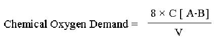

## Theory
 
&nbsp;

In recent times, with the increase of pollution by discharging large amount of various chemicals, oxidisable organic substances of different matter enter in the aquatic system. BOD values alone does not give a clear picture of organic matter contend of the water sample. In addition, the presence of various toxicant in the sample. In addition, the presence of various toxicants in the sample may severely affect the validity of BOD test. Hence chemical oxygen demand (COD) test is a better estimate of organic matter which needs no sophistication and is time saving. However COD that is the oxygen consumed (OC) does not differentiate the stable organic matter from the unstable form, therefore the COD value are not directly comparable to that of BOD.

 &nbsp;

The amount of organic matter in water is estimated based on their oxidisability by chemical oxidants, such as potassium permanganate or potassium dichromate. For many years, the potassium permanganate was used as oxidizing agent for measuring chemical oxygen demand. But the oxidizing capacity of potassium permanganate varied widely. Nowadays, Potassium dichromate is used instead of potassium permanganate because it is more effective, relatively cheap, easy to purify and is able to oxidize almost all organic compounds.

&nbsp;

In this method, a fixed volume of oxidant (here potassium dichromate) is added to the water sample. The organic matter present in the water sample is first oxidized with known volume of potassium dichromate and then excess of oxygen is allowed to react with potassium iodide to liberate iodine in amounts equal to the excess oxygen, which is estimated titrimetrically with sodium thiosulphate as an indicator.

 &nbsp;

 

## Calculation

&nbsp;

